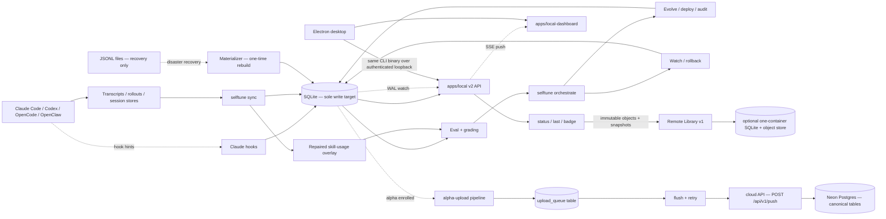
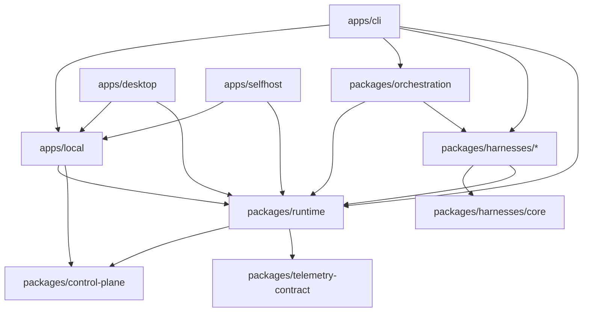
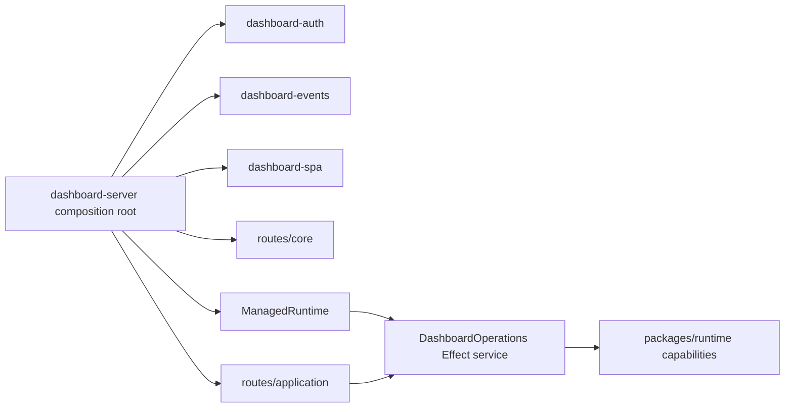
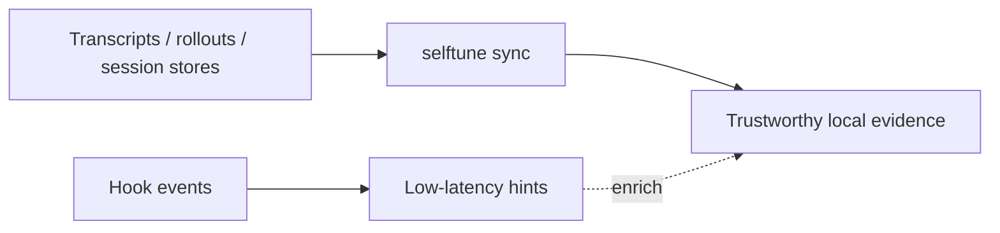
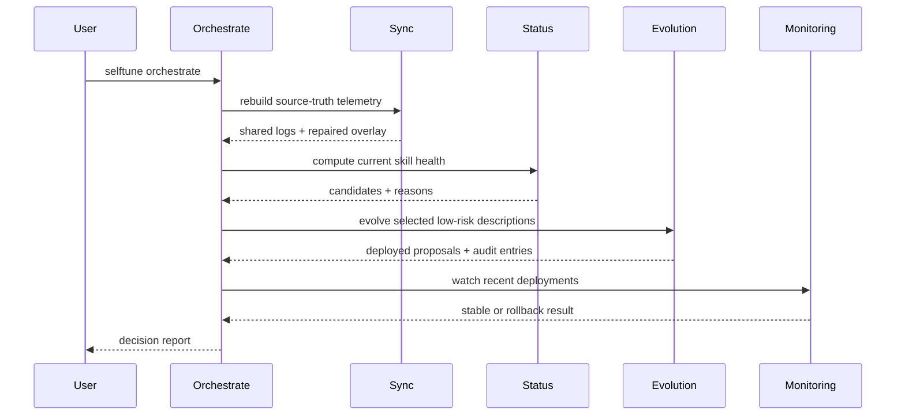
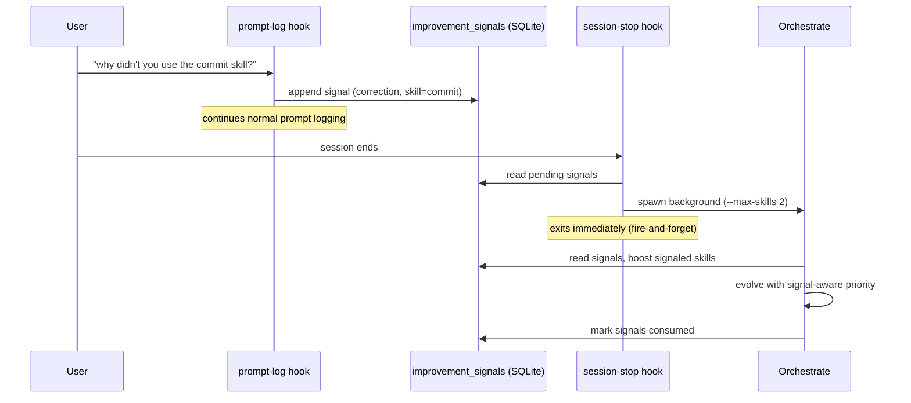

<!-- Verified: 2026-03-27 -->

# Architecture — selftune

selftune is a local-first feedback loop for AI agent skills. It turns saved agent activity into trustworthy local evidence, uses that evidence to improve low-risk skill behavior, and exposes the result through CLI surfaces and a local dashboard SPA.

## Agent-First Design Principle

selftune is a **skill consumed by AI agents**, not a CLI tool for humans. The user installs the skill (`npx skills add selftune-dev/selftune`), then interacts through their coding agent ("set up selftune", "improve my skills"). The agent reads `skill/SKILL.md` to discover commands, routes to the correct workflow doc, and executes CLI commands on the user's behalf.

This means:

- `skill/SKILL.md` is the primary product surface (agent reads this to know what to do)
- `skill/workflows/*.md` are the agent's step-by-step guides
- `apps/cli/` composes the agent-facing API; `cli/selftune/` only preserves old entrypoints
- Error messages and output should be machine-parseable (JSON) and guide the agent to the next action

If you are new to the repo, read these in order:

1. [docs/design-docs/system-overview.md](docs/design-docs/system-overview.md)
2. [PRD.md](PRD.md)
3. This file

## Architecture At A Glance



## Operating Rules

- **Source-truth first.** Transcripts, rollouts, and session stores are authoritative. Hooks are low-latency hints.
- **Shared local evidence.** Downstream modules communicate through SQLite (sole operational store) and repaired overlays. Legacy JSONL files are retained on disk for disaster recovery only.
- **Autonomy with safeguards.** Low-risk description evolution can deploy automatically, but validation, watch, and rollback remain mandatory.
- **Local-first product surfaces.** `status`, `last`, and the dashboard read from local evidence, not external services.
- **Alpha data pipeline.** Opted-in users upload V2 canonical push payloads to the cloud API via `alpha-upload/`. Uploads are fail-open and never block the orchestrate loop.
- **Generic scheduling first.** `selftune cron setup` is the main automation path (auto-detects platform). `selftune schedule` is a backward-compatible alias.
- **One runtime owner.** The `selftune` binary owns daemon startup, the durable manifest, and launchd/systemd/Task Scheduler registration. Desktop is a thin supervisor and renderer host.
- **Deployment-neutral backup.** The Remote Library protocol syncs immutable skills, drafts, Skill Sets, and decision metadata to SelfTune Cloud or the one-container OSS self-host. Raw transcripts remain local.

## Domain Map

| Domain                | Owner                                                                | Responsibility                                                                                        |
| --------------------- | -------------------------------------------------------------------- | ----------------------------------------------------------------------------------------------------- |
| CLI composition       | `apps/cli/`                                                          | Parse commands and compose runtime, orchestration, harness, and local-host capabilities               |
| Local host            | `apps/local/`                                                        | Authenticated daemon, HTTP API, routes, and OS service lifecycle                                      |
| Harness protocol      | `packages/harnesses/core/`                                           | Harness-neutral event types, normalization, stdin dispatch, and session utilities                     |
| Harness integrations  | `packages/harnesses/{claude-code,codex,opencode,cline,pi,openclaw}/` | Platform hooks, installers, and transcript/session ingestion                                          |
| Runtime               | `packages/runtime/`                                                  | Local domain types, SQLite, evaluation, evolution, monitoring, Library, and reusable CLI capabilities |
| Orchestration         | `packages/orchestration/`                                            | Source sync, repair, improve, autonomous run, canonical export, and scheduling workflows              |
| Control plane         | `packages/control-plane/`                                            | Effect services, typed failures, domain programs, and live/test Layers                                |
| Dashboard client      | `packages/dashboard-core/`, `packages/ui/`, `apps/local-dashboard/`  | Host-neutral dashboard behavior and the local React client                                            |
| Desktop               | `apps/desktop/`                                                      | Scoped Effect supervisor plus native window, tray, updater, and IPC adapters around the compiled CLI |
| Self-host             | `apps/selfhost/`                                                     | One-container dashboard and tenant-scoped Remote Library                                              |
| Compatibility         | `bin/selftune.cjs`, `cli/selftune/`                                  | Preserve the npm binary and existing hook file paths; no new implementation belongs here              |
| Agent product surface | `skill/`                                                             | Agent-facing routing, workflows, settings, and references                                             |

## Dependency Direction

The workspace follows the same composition rule as Executor: applications assemble capabilities;
packages do not reach back into applications.



Mechanical rules enforced by `lint-architecture.ts`:

- `packages/runtime` cannot import harness, orchestration, or local-host packages.
- Harness packages cannot import orchestration or local-host packages; harness core cannot import runtime.
- `packages/orchestration` may compose runtime and harness packages, but cannot import an application.
- Applications consume behavior through `@selftune/*` package exports.
- `cli/selftune` contains compatibility shims only.

Source sync is an Effect service contract in `packages/runtime/source-sync.ts`. The live Layer is
owned by orchestration, where platform ingestors are available. Evolution, monitoring, and init
receive the capability from the application composition edge rather than importing platform code.

### Local Host Composition

`apps/local/src/dashboard-server.ts` is the local process composition root. It binds the socket,
constructs long-lived resources, orders transport handlers, and disposes those resources on
shutdown. It does not implement dashboard workflows or own route payload parsing.



- `DashboardOperations` is the typed application capability boundary. Its live `Layer` acquires the
  control-plane runtime, maps expected CLI and source-update failures into
  `DashboardOperationError`, redacts unexpected causes, and releases the runtime when the managed
  scope closes.
- `routes/application.ts` validates request bodies with Effect Schema and translates HTTP requests
  into service effects. It contains no live filesystem, credential, or synchronization wiring.
- `routes/core.ts` owns the established read, report, badge, and CLI-action endpoints plus their
  SQLite and status-cache dependencies.
- `dashboard-auth.ts`, `dashboard-events.ts`, and `dashboard-spa.ts` own authentication state, live
  event resources, and SPA transport respectively. Their state is private to each server instance.

Tests can replace individual application capabilities through the same Layer construction path used
by the live server. HTTP integration tests remain responsible for route order, CORS, authentication,
SSE, assets, and process shutdown.

## Two Operating Modes

selftune has two distinct operating modes with different execution models:

### Interactive Mode (agent-driven)

The user talks to their coding agent. The agent reads `skill/SKILL.md`, routes
to the correct workflow, and runs CLI commands. The agent is the operator.

```
User: "improve my skills"
  → Agent reads SKILL.md → routes to Orchestrate workflow
  → Agent runs: selftune orchestrate
  → Agent summarizes results to user
```

### Automated Mode (OS-driven)

System scheduling (cron/launchd/systemd) calls the CLI binary directly.
No agent session needed, no token cost. Set up via `selftune cron setup`.

```
OS scheduler fires every 6 hours
  → selftune orchestrate --max-skills 3
  → sync → status → auto-grade ungraded → candidate selection → evolve → watch → write results to SQLite
  → Next interactive session sees improved SKILL.md
```

The agent is NOT in the loop for automated runs. This is intentional:
automated runs are routine maintenance (sync, low-risk evolutions) that
don't need agent intelligence or user interaction.

For desktop persistence, `selftune service install` registers the same CLI
binary as a user-owned launchd, systemd, or Task Scheduler service. The
Electron process can exit without terminating observation. It calls the CLI
for status and repair instead of owning platform service files itself.

Inside Electron, `DesktopRuntime` is a scoped Effect service and the only owner
of active and pending sidecar connections, supervision transitions, connection
generations, background-service state, health monitoring, recovery, reset, and
shutdown. One semaphore queues every explicit ownership mutation, while health
and child-exit signals are bound to the connection generation that produced
them. A stale probe therefore cannot recover a replacement runtime, and a
restart, background toggle, reset, or update preparation cannot be reported as
complete without running.

Electron-specific resources remain adapters around that service:
`desktop-window.ts` stages authenticated `BrowserWindow` replacement before a
connection is committed, `desktop-shell.ts` owns tray and updater controllers,
and `desktop-ipc.ts` owns removable, schema-validated IPC handlers. The main
entrypoint only composes these owners and disposes the managed Effect runtime
before allowing Electron to quit.

## Data Architecture

SQLite is the sole write target and operational database. Hooks and sync write
directly to SQLite via `localdb/direct-write.ts`. JSONL writes have been removed
(Phase 3 complete). Existing JSONL files are retained on disk but only cover
pre-cutover history. Post-cutover recovery requires `selftune export` snapshots
or SQLite backups. The `skill_usage` table still exists in the schema alongside
`skill_invocations` for backward compatibility; new consumers should use
`skill_invocations` via `localdb/queries.ts`.

```text
Primary Store: SQLite (~/.selftune/selftune.db)
├── Hooks write directly via localdb/direct-write.ts (sole write path)
├── Sync writes directly via localdb/direct-write.ts
├── All reads (orchestrate, evolve, grade, status, dashboard) query SQLite
└── Target freshness model: WAL-mode watch powers SSE live updates

Legacy JSONL files (~/.claude/*.jsonl) — pre-cutover history only, no longer written
├── session_telemetry_log.jsonl    Session telemetry records
├── skill_usage_log.jsonl          Skill trigger/miss records (deprecated; consolidated into skill_invocations SQLite table)
├── all_queries_log.jsonl          User prompt log
├── evolution_audit_log.jsonl      Evolution decisions + evidence
├── orchestrate_runs.jsonl         Orchestrate run reports
└── canonical_telemetry_log.jsonl  Normalized cross-platform records

Core Loop: reads SQLite
├── orchestrate.ts  → db.query("SELECT ... FROM sessions ...")
├── evolve.ts       → db.query("SELECT ... FROM evolution_audit ...")
├── grade.ts        → db.query("SELECT ... FROM sessions ...")
└── status.ts       → db.query("SELECT ... FROM sessions, skill_usage, queries ...")

Rebuild Paths:
├── materialize.ts  — runs once on startup for historical JSONL backfill
└── selftune export — generates JSONL from SQLite on demand

Alpha Upload Path (opted-in users only):
├── stage-canonical.ts  — reads canonical records from SQLite + evolution evidence + orchestrate_runs into canonical_upload_staging table
├── build-payloads.ts   — reads staging table via single monotonic cursor, produces V2 canonical push payloads
├── flush.ts            — POSTs to cloud API (POST /api/v1/push) with Bearer auth, handles 409/401/403
└── Cloud storage: Neon Postgres (raw_pushes for lossless ingest → canonical tables for analysis)
```

Hooks and sync write exclusively to SQLite. JSONL writes have been removed
(Phase 3 complete). All local product reads go through SQLite. The materializer
runs once on startup to backfill any historical JSONL data not yet in the
database. `selftune export` can regenerate JSONL from SQLite when needed for
portability or debugging.

The dashboard uses WAL-based invalidation for SSE live updates — JSONL file
watchers have been removed from the dashboard server.

## Repository Shape

```text
apps/
├── cli/src/main.ts             Command router and composition root
├── local/src/                  Daemon/service host, Effect operations, transport resources, routes
├── local-dashboard/src/        React dashboard
├── desktop/                    Electron distribution host
└── selfhost/                   Container distribution host

packages/
├── runtime/                    Reusable local capabilities and SQLite-backed science
├── orchestration/src/          Cross-capability workflows and Effect live composition
├── harnesses/
│   ├── core/src/               Harness-neutral protocol
│   ├── claude-code/src/        Hooks and replay ingestion
│   ├── codex/src/              Hooks, installer, wrapper, and rollout ingestion
│   ├── opencode/src/           Hooks, installer, and ingestion
│   ├── cline/src/              Hooks and installer
│   ├── pi/src/                 Hooks, installer, and ingestion
│   └── openclaw/src/           Cron adapter and ingestion
├── control-plane/              Effect domain services and Layers
├── dashboard-core/             Shared dashboard application shell
├── telemetry-contract/         Canonical telemetry schemas and types
└── ui/                         Shared UI primitives

cli/selftune/                    Compatibility shims only
skill/                           Agent-facing product surface
```

The root package publishes the compatibility facade and bundles its private workspace packages.
`apps/cli` is the executable source; `apps/local` is the long-lived process host.

## Module Definitions

| Module              | Owner                           | May Import                                                            |
| ------------------- | ------------------------------- | --------------------------------------------------------------------- |
| Runtime             | `packages/runtime`              | control plane, telemetry contract, Bun/Effect/platform libraries      |
| Harness core        | `packages/harnesses/core`       | platform libraries only                                               |
| Harness integration | `packages/harnesses/<name>`     | harness core, runtime, and shared Claude hook behavior where required |
| Orchestration       | `packages/orchestration`        | runtime, harness integrations, telemetry contract                     |
| Local host          | `apps/local`                    | runtime, Effect, platform libraries                                   |
| CLI                 | `apps/cli`                      | runtime, orchestration, harness integrations, local host              |
| Desktop/self-host   | `apps/desktop`, `apps/selfhost` | exported package capabilities and dashboard assets                    |
| Compatibility       | `cli/selftune`, `bin`           | stable package exports only                                           |

## Truth Model: Hooks vs. Source Systems



Why this matters:

- Hooks can be missing, polluted, or agent-specific.
- Source sync is how selftune stays cross-agent and backfillable.
- Autonomous changes should be justified from the synced evidence path, not from hooks alone.

## Autonomous Loop



Current policy:

- Low-risk description evolution is autonomous by default.
- `--review-required` is an opt-in stricter policy mode.
- Validation, watch, and rollback are the main safety system.

## Signal-Reactive Improvement

In addition to scheduled and interactive orchestration, selftune detects
high-priority improvement signals in real-time and triggers focused
orchestration automatically.



Signal detection is pure regex in the prompt-log hook — no LLM calls, no
network. Patterns include corrections ("why didn't you use X?", "you
should have used X"), explicit requests ("please use the X skill"), and
manual invocations. Skill names are matched against the installed skill
directory listing.

The orchestrator boosts signaled skills by +150 priority per signal
(capped at +450) and relaxes the minimum evidence gate and UNGRADED gate
for skills with pending signals. After a run completes, signals are
marked consumed so they don't affect subsequent runs.

## Config System

`selftune init` writes `~/.selftune/config.json`.

| Field             | Type                                                      | Description                                   |
| ----------------- | --------------------------------------------------------- | --------------------------------------------- |
| `agent_type`      | `claude_code \| codex \| opencode \| openclaw \| unknown` | Detected host agent                           |
| `cli_path`        | `string`                                                  | Absolute path to the selftune CLI entry point |
| `llm_mode`        | `agent \| api`                                            | How grading/evolution run model calls         |
| `agent_cli`       | `string \| null`                                          | Preferred agent binary                        |
| `hooks_installed` | `boolean`                                                 | Whether Claude hooks are configured           |
| `initialized_at`  | `string`                                                  | ISO timestamp of the last bootstrap           |

## Shared Local Artifacts

| Artifact                                | Writer                                              | Reader                                                                                     |
| --------------------------------------- | --------------------------------------------------- | ------------------------------------------------------------------------------------------ |
| `~/.claude/session_telemetry_log.jsonl` | Legacy / export-only (`selftune export`)            | Materializer recovery, export                                                              |
| `~/.claude/skill_usage_log.jsonl`       | Legacy / export-only (`selftune export`)            | Materializer recovery (deprecated — consolidated into `skill_invocations` table in SQLite) |
| `~/.claude/skill_usage_repaired.jsonl`  | Legacy / export-only (`selftune export`)            | Materializer recovery (deprecated — consolidated into `skill_invocations` table in SQLite) |
| `~/.claude/all_queries_log.jsonl`       | Legacy / export-only (`selftune export`)            | Materializer recovery, export                                                              |
| `~/.claude/evolution_audit_log.jsonl`   | Legacy / export-only (`selftune export`)            | Materializer recovery, export                                                              |
| `~/.claude/orchestrate_runs.jsonl`      | Legacy / export-only (`selftune export`)            | Materializer recovery, export                                                              |
| `~/.claude/improvement_signals.jsonl`   | Legacy / export-only (`selftune export`)            | Materializer recovery, export                                                              |
| `~/.claude/.orchestrate.lock`           | Orchestrator                                        | session-stop hook (staleness check)                                                        |
| `~/.selftune/*.sqlite`                  | Hooks (direct-write), sync, materializer (backfill) | All reads: orchestrate, evolve, grade, status, dashboard                                   |

## The Evaluation Model

| Tier             | What It Checks                                | Automated                |
| ---------------- | --------------------------------------------- | ------------------------ |
| Tier 1 — Trigger | Did the skill fire when it should have?       | Yes                      |
| Tier 2 — Process | Did the session follow the expected workflow? | Yes                      |
| Tier 3 — Quality | Was the resulting work actually good enough?  | Yes, via agent-as-grader |

## Invocation Taxonomy

| Type       | Description                                       |
| ---------- | ------------------------------------------------- |
| Explicit   | The user names the skill directly                 |
| Implicit   | The task matches the skill without naming it      |
| Contextual | The task is implicit with real-world domain noise |
| Negative   | Nearby queries that should not trigger the skill  |

## Current Known Tensions

- Candidate selection is improving, but still needs stronger real-world evidence gating.
- Local and cloud dashboard semantics should converge on the same payload contracts.
- The CLI core still avoids runtime dependencies, while the local SPA intentionally uses frontend build-time dependencies.
- OpenClaw cron remains supported, but it is no longer the primary automation story.

## Related Docs

- [docs/design-docs/system-overview.md](docs/design-docs/system-overview.md)
- [docs/integration-guide.md](docs/integration-guide.md)
- [docs/design-docs/evolution-pipeline.md](docs/design-docs/evolution-pipeline.md)
- [docs/design-docs/monitoring-pipeline.md](docs/design-docs/monitoring-pipeline.md)
- [docs/design-docs/live-dashboard-sse.md](docs/design-docs/live-dashboard-sse.md)
- [docs/design-docs/sqlite-first-migration.md](docs/design-docs/sqlite-first-migration.md)
