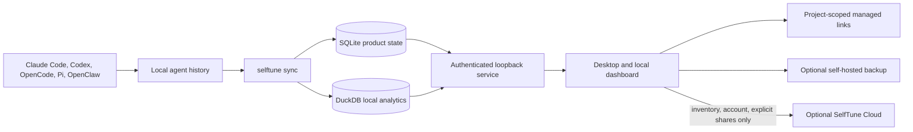

# SelfTune OSS architecture

SelfTune is a local-first desktop product for finding, organizing, packaging,
project-scoping, sharing, and maintaining Agent Skills.

## Runtime shape

The local machine owns skill packages, transcripts, evaluation evidence, drafts,
and improvement execution. SelfTune Cloud is not a remote execution environment
or a raw telemetry warehouse. When explicitly connected, it stores account and
subscription state, device records, a privacy-safe inventory manifest, security
audit entries, and packages the user deliberately shares.

## Ownership

| Area                                | Owner                                                         |
| ----------------------------------- | ------------------------------------------------------------- |
| CLI composition                     | `apps/cli`                                                    |
| Local service                       | `apps/local`                                                  |
| Desktop host                        | `apps/desktop`                                                |
| Local dashboard                     | `apps/local-dashboard`                                        |
| Product routes and screens          | `packages/app-core`, `packages/dashboard-core`, `packages/ui` |
| Skill library and packaging         | `packages/library`, `packages/control-plane`                  |
| Local state                         | `packages/local-store`, `packages/observability`              |
| Agent integrations                  | `packages/harnesses/*`                                        |
| Optional self-hosted backup         | `apps/selfhost`                                               |
| Agent-facing operating instructions | `skill`                                                       |

## Rules

- Skill bytes and agent history remain local unless the user explicitly shares
  a package or configures their own self-hosted backup.
- Project scoping uses managed filesystem links so an agent sees the right
  skills only where they are needed.
- SQLite is operational product state; DuckDB is bounded local analytics.
- JSONL exists for compatibility and recovery, not as a second source of truth.
- Apps compose capabilities; packages never import app implementations.
- Destructive library operations require preview, explicit approval, and a
  recoverable receipt.
- The public repository has no dependency on Neon, Fly.io, or a hosted
  improvement sandbox.

## Optional hosted-state seam

The product defines one customer-visible hosted-state seam. Its portable
contracts currently cover Desktop account state, privacy-safe manifests, and
consented contributor signals. Explicit sharing uses the Remote Library
protocol. The managed Convex adapter additionally provides device linking,
update notices, and account administration; the OSS SQLite adapter provides
configured users and roles, manifests, Remote Library sharing, contributor
aggregates, and an audit log inside one customer trust boundary.

Managed billing, public signup, unrelated-customer SaaS isolation, abuse
operations, and fleet administration are not part of the portable seam. Skill
contents and operational history remain local unless the user explicitly shares
a package or consents to a bounded contributor signal.
