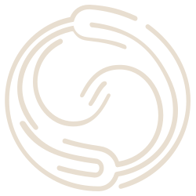

<div align="center">



# selftune

**Skill-level observability and self-improvement for AI agents.**

[](https://github.com/selftune-dev/selftune/actions/workflows/ci.yml)
[](https://github.com/selftune-dev/selftune/actions/workflows/codeql.yml)
[](https://securityscorecards.dev/viewer/?uri=github.com/selftune-dev/selftune)
[](https://www.npmjs.com/package/selftune)
[](LICENSE)
[](https://www.typescriptlang.org/)
[](https://www.npmjs.com/package/selftune?activeTab=dependencies)
[](https://bun.sh)

Your agent skills learn how you work. Detect what's broken. Fix it automatically.

**[Website](https://selftune.dev)** · **[Install](#install)** · **[Local vs Cloud](#local-vs-cloud)** · **[Use Cases](#built-for-how-you-actually-work)** · **[How It Works](#how-it-works)** · **[Commands](#commands)** · **[Platforms](#platforms)** · **[Docs](https://docs.selftune.dev)**

</div>

---

selftune is an open-source agent skill observability toolkit that watches how your AI agent uses its skills, detects when skills fail silently, and automatically rewrites skill descriptions to match how you actually talk. Think of it as observability + continuous improvement for your agent's skill routing layer.

Your skills don't understand how you talk. You say "make me a slide deck" and nothing happens — no error, no log, no signal. selftune watches your real sessions, learns how you actually speak, and rewrites skill descriptions to match. Automatically.

Works with **Claude Code** (primary), **Codex**, **OpenCode**, **Cline**, **OpenClaw**, and **Pi**. Bun-native with typed Drizzle persistence. MIT licensed.

## Install

```bash
npx skills add selftune-dev/selftune
```

Then tell your agent: **"initialize selftune"**

Two minutes. No API keys. No external services. No configuration ceremony. Uses your existing agent subscription. You'll see which skills are undertriggering.

**CLI only** (no skill, just the CLI):

```bash
npx selftune@latest doctor
```

## Updating

The skill and CLI ship together as one npm package. To update:

```bash
npx skills add selftune-dev/selftune
```

This reinstalls the latest version of both the skill (SKILL.md, workflows) and the CLI. `selftune doctor` will warn you when a newer version is available.

If you already have the local dashboard running, rerun:

```bash
selftune dashboard
```

The command now reuses a healthy dashboard already on the target port and
automatically restarts an older standalone dashboard instance after upgrades so
the new UI is picked up without manual process hunting. Use
`selftune dashboard --restart` to force a restart.

If the browser is still holding an older client after a restart, the dashboard
now shows an explicit reload prompt instead of silently staying stale.

## Desktop App

The native desktop host uses the same local SQLite data, skill discovery, and
React dashboard as the CLI. It bundles the same compiled `selftune` binary used
for terminal commands, starts `selftune daemon run` on authenticated loopback,
and shows every installed skill even before SelfTune has observed a session.

First-run onboarding lets you choose which harness histories to import, where
to install live SelfTune hooks, and whether to run observability, daily health
recommendations, or autonomous improvement in the background.

Installed builds can keep the authenticated local service alive through an
owner-scoped LaunchAgent, systemd user service, or Windows scheduled task after
the window exits. The CLI owns those service definitions, restarts after
crashes, and is controlled from the menu bar. Signed desktop releases update in
place from GitHub Releases, with background download and an explicit restart
prompt when the new version is ready. Sync & Backup tokens are stored in the
macOS Keychain, Linux Secret Service, or Windows Credential Manager when the
platform vault is available.

Desktop does not require a Cloud account for its local workflow. From
**Settings → Sync & Backup**, **Connect Cloud account** opens a short-lived
browser approval where you can sign in or create an account. Approval securely
links the device and attempts the first backup without copying an API token;
raw transcripts remain local. The sidebar server picker exposes the same
shortcut: SelfTune Cloud shows **Connect** until linked and **Connected**
afterward. Connecting keeps you in Desktop; selecting the connected row opens
Sync & Backup locally, while **Open Cloud dashboard ↗** is a separate browser
action. Desktop returns to the foreground when browser approval completes.

Build and run it from source:

```bash
cd apps/desktop
bun run dev
```

Production packaging commands are `bun run package:mac`, `package:win`, and
`package:linux` after `bun run build`. See
[Desktop Control Plane](docs/design-docs/desktop-control-plane.md) for the
runtime and security model.

## Self-Hosting

The optional OSS self-host packages the same dashboard plus the Remote Library
v1 protocol in one non-root container. It needs no Postgres, object-storage
service, queue, or worker: tenant-scoped SQLite and immutable content-addressed
objects live together in one `/data` volume. Raw transcripts never sync.

```bash
cd apps/selfhost
cp .env.example .env
# Set SELFTUNE_AUTH_TOKEN to: openssl rand -hex 32
chmod 600 .env
docker compose up -d
```

Point any SelfTune installation at it with `selftune library configure`, then
use `library preview`, `sync`, `status`, and `diagnostics` exactly as with
SelfTune Cloud. Optional account tokens enable recipient-scoped private
sharing between organizations. See [SelfTune Self-Host](apps/selfhost/README.md)
for TLS, account, backup, and restore instructions.

## Local, self-hosted, and managed

SelfTune is one local-first product with two optional collaboration hosts. The
actual skills, sessions, evaluations, and improvements stay on your computer in
all three modes.

| Capability                                                    | Local Desktop             | Customer self-host              | Managed SelfTune Cloud         |
| ------------------------------------------------------------- | ------------------------- | ------------------------------- | ------------------------------ |
| Discover, organize, scope, evaluate, and improve skills       | Yes                       | Yes                             | Yes, through connected Desktop |
| Users, roles, manifests, sharing, and audit                  | Local-only                | Yes, inside your trust boundary | Yes                            |
| Browser device linking and managed update notices            | No                        | Not yet                         | Yes                            |
| Consent-based contributor signals                             | Build and preview locally | Relay and aggregate             | Relay and aggregate            |
| Raw prompts, sessions, paths, and evaluations uploaded        | Never by default          | No                              | No                             |
| Billing, trials, and invoices                                 | No                        | No                              | Yes                            |
| Cross-customer SaaS operations                                | No                        | No                              | Yes                            |

Start with Desktop. Add the OSS self-host when your organization wants to own
its collaboration data and infrastructure. Add managed Cloud when you want the
same narrow collaboration journeys operated for you. Self-hosting does not need
Stripe or PragSys's multi-customer control plane.

There is no separate cloud CLI. The same `selftune` binary can connect to either
host for Remote Library sharing and privacy-safe manifests. Contributor relay
follows the configured Remote Library host and credential, so selecting a
self-host also keeps those aggregates inside that trust boundary. Evaluation,
proposal generation, validation, and applying changes remain local.

If you're contributing to the local dashboard runtime or HMR flow, see
[CONTRIBUTING.md](CONTRIBUTING.md).

## Before / After

<p align="center">
  
</p>

selftune learned that real users say "slides", "deck", "presentation for Monday" — none of which matched the original skill description. It rewrote the description to match how people actually talk. Validated against the eval set. Deployed with a backup. Done.

## Built for How You Actually Work

**I write and use my own skills** — Your skill descriptions don't match how you actually talk. Tell your agent "improve my skills" and selftune learns your language from real sessions, evolves descriptions to match, and validates before deploying. No manual tuning.

**I publish skills others install** — Your skill works for you, but every user talks differently. selftune gives creators a real before-ship / after-ship loop: test the router before launch, bundle creator-directed contribution for selftune-connected installs, inspect contributor signals after launch, then turn that signal into proposals and watched improvements.

**I manage an agent setup with many skills** — You have 15+ skills installed. Some work. Some don't. Some conflict. Tell your agent "how are my skills doing?" and selftune gives you a health dashboard and automatically improves the skills that aren't keeping up.

**I use skills for non-coding work** — Marketing workflows, research pipelines, compliance checks, slide decks. You say "make me a presentation" and nothing happens. selftune learns that "slides", "deck", and "presentation for Monday" all mean the same skill — and fixes the routing automatically.

## Creator Lifecycle

If you publish skills, the loop is:

1. structure the skill router, workflows, references, and tools clearly
2. validate the skill package and test the router before launch
3. deploy only after evals, unit tests, replay validation, and baseline are in place
4. bundle `selftune.contribute.json` with `selftune creator-contributions enable`
5. review contributor signals in Selftune Cloud after launch
6. create proposals from contributor aggregate data only when thresholds are met
7. apply and watch changes through the normal proposal flow

## How to Test a Skill

The simplified lifecycle is:

```bash
selftune verify --skill-path path/to/SKILL.md
selftune publish --skill-path path/to/SKILL.md
selftune search-run --skill-path path/to/SKILL.md --surface both
selftune improve --skill my-skill --skill-path path/to/SKILL.md --dry-run --validation-mode replay
selftune run --dry-run
```

What each step gives you:

- `verify` runs the draft-package readiness check first, then emits the benchmark-style package report once the draft is ready. If readiness is still incomplete, it surfaces the next missing low-level step instead of guessing.
- `publish` delegates to the draft-package publish flow and starts `watch` by default. Use `--no-watch` if you want a manual monitoring handoff.
- `search-run` evaluates a bounded minibatch of routing/body package variants against the accepted frontier and persists the measured winner plus provenance.
- `search-run` is currently an explicit package-improvement surface. `run` / `orchestrate` do not auto-select bounded package search yet.
- `improve` is the intention-level alias for `evolve` and `evolve body`. Use `--scope description|routing|body` when you already know the right mutation surface.
- `run` is the intention-level alias for `orchestrate`, so you can preview or operate the whole closed loop without remembering the internal command name.

The advanced lifecycle primitives are still available when you need explicit control:

```bash
selftune create check --skill-path path/to/SKILL.md
selftune eval generate --skill my-skill
selftune eval unit-test --skill my-skill --generate --skill-path path/to/SKILL.md
selftune create replay --skill-path path/to/SKILL.md --mode package
selftune create baseline --skill-path path/to/SKILL.md --mode package
selftune create report --skill-path path/to/SKILL.md
selftune create publish --skill-path path/to/SKILL.md --watch
selftune evolve --skill my-skill --skill-path path/to/SKILL.md --dry-run --validation-mode replay
selftune grade baseline --skill my-skill --skill-path path/to/SKILL.md
selftune watch --skill my-skill
```

The local dashboard overview, per-skill report, and `selftune status` now all read from those artifacts to show whether a skill is blocked on testing, ready to deploy, or already under watch.

## How It Works

<p align="center">
  
</p>

A continuous feedback loop that makes your skills learn and adapt. Automatically. Your agent runs everything — you just install the skill and talk naturally.

**Observe** — Seven real-time hooks capture every query, every skill invocation, and every correction signal. Structured telemetry — not raw logs. On Claude Code, hooks install automatically during `selftune init`. Backfill existing transcripts with `selftune ingest claude`.

**Detect** — Finds the gap between how you talk and how your skills are described. You say "make me a slide deck" and your pptx skill stays silent — selftune catches that mismatch. Clusters missed queries by invocation type. Detects correction signals ("why didn't you use X?") and triggers immediate improvement.

**Evolve** — Generates multiple proposals biased toward different invocation types, validates each against your real eval set with majority voting, runs constitutional checks, then gates with an expensive model before deploying. Not guesswork — evidence. Automatic backup on every deploy.

**Watch** — After deploying changes, selftune monitors trigger rates, false negatives, and per-invocation-type scores. If anything regresses, it rolls back automatically. No manual monitoring needed.

**Automate** — Run `selftune cron setup` to install OS-level scheduling. selftune syncs, grades, evolves, and watches on a schedule — fully autonomous.

## FAQ

### What is selftune?

selftune is an open-source CLI and agent skill that provides skill-level observability for AI coding agents. It monitors how skills are triggered (or missed), grades execution quality, and automatically evolves skill descriptions so they match how users actually talk. It works locally with zero API keys — using your existing agent subscription for any LLM calls.

### How is selftune different from LLM observability tools?

LLM observability tools (Langfuse, LangSmith, Arize) trace what happens inside model calls — token usage, latency, chain failures. selftune operates at a different layer: it monitors whether the _right skill was triggered_ for the _right query_ in the first place. They're complementary, not competitive.

### How is this different from agents that "learn"?

Some agents claim self-improvement by saving notes about what worked. That's knowledge persistence — not a closed loop. There's no measurement, no validation, and no way to know if the saved notes are actually correct.

selftune is empirical. It observes real sessions, grades execution quality, detects missed triggers, proposes changes, validates them against eval sets, deploys with automatic backup, monitors for regressions, and rolls back on failure. Twelve interlocking mechanisms — not one background thread writing markdown.

| Approach                  | Measures quality? | Validates changes?          | Detects regressions?   | Rolls back? |
| ------------------------- | ----------------- | --------------------------- | ---------------------- | ----------- |
| Agent saves its own notes | No                | No                          | No                     | No          |
| Manual skill rewrites     | No                | No                          | No                     | No          |
| **selftune**              | 3-tier grading    | Eval sets + majority voting | Post-deploy monitoring | Automatic   |

## Commands

Your agent runs these — you just say what you want ("improve my skills", "show the dashboard").

| Group        | Command                                            | What it does                                                                                |
| ------------ | -------------------------------------------------- | ------------------------------------------------------------------------------------------- |
|              | `selftune status`                                  | Get a one-line health summary plus compact attention / improving highlights                 |
|              | `selftune last`                                    | Quick insight from the most recent session                                                  |
|              | `selftune verify --skill-path <path>`              | Check draft-package readiness, then emit benchmark-style verification evidence              |
|              | `selftune publish --skill-path <path>`             | Publish a verified draft package and start watch by default                                 |
|              | `selftune search-run --skill-path <path>`          | Run bounded package search over routing/body variants against the measured frontier         |
|              | `selftune improve --skill <name>`                  | Route to the smallest matching evolution surface                                            |
|              | `selftune run`                                     | Run the full autonomous loop through the simplified lifecycle alias                         |
|              | `selftune orchestrate`                             | Advanced alias for `run`                                                                    |
|              | `selftune sync`                                    | Replay source-truth transcripts/rollouts into SQLite and refresh repair state               |
|              | `selftune dashboard`                               | Open the visual skill health dashboard                                                      |
|              | `selftune service install`                         | Keep the authenticated dashboard runtime alive under the native OS supervisor               |
|              | `selftune service status --json`                   | Inspect registration, process state, version, and durable daemon health                     |
|              | `selftune service doctor --json`                   | Diagnose the fixed current-user Windows service-lock compatibility state                    |
|              | `selftune service repair-lock --json`              | Repair only a proven stale pre-SQLite Windows service lock                                  |
|              | `selftune doctor`                                  | Health check: logs, hooks, config, permissions                                              |
| **skills**   | `selftune skills audit`                            | Inventory installed skills and recommend keep, repair, consolidate, or quarantine review    |
|              | `selftune skills consolidate --skill <name>`       | Preview or apply reversible archive-and-link cleanup for duplicate installations            |
|              | `selftune skills consolidate --all-safe`           | Preview or apply all source-confirmed consolidation recommendations                         |
|              | `selftune skills consolidation-rollback --id <id>` | Restore every archived copy and remove receipt-owned project links                          |
|              | `selftune skills quarantine --skill <name>`        | Reversibly remove an approved skill package from active discovery                           |
|              | `selftune skills restore --id <id>`                | Restore a quarantined package to its exact previous registry path                           |
| **registry** | `selftune registry install <name>`                 | Install an exact workspace-managed skill revision and record its local integrity baseline   |
|              | `selftune registry suggest [--summary <text>]`     | Recover a managed edit only when automatic workspace delivery reports a failure             |
|              | `selftune registry sync`                           | Apply reviewed registry heads while refusing to overwrite unsubmitted local changes         |
|              | `selftune registry sync --automatic-only`          | Apply only skills whose workspace rollout policy is automatic                               |
| **library**  | `selftune library`                                 | Reconcile installed, cached, draft, and archived revisions into one Library                 |
|              | `selftune library synthesize scan`                 | Build local evidence-backed candidates without uploading raw transcripts                    |
|              | `selftune library synthesize evaluate`             | Run package, replay, routing, baseline, and regression gates for an approved draft          |
|              | `selftune library synthesize release`              | Release only the unchanged immutable revision covered by a passing gate                     |
|              | `selftune library preview`                         | Inspect the exact Sync & Backup artifact list and byte counts before sync                   |
|              | `selftune library sync`                            | Back up selected immutable artifacts to SelfTune Cloud or a self-hosted server              |
| **sets**     | `selftune sets suggest`                            | Classify skills and validate recurring set patterns against later local sessions            |
|              | `selftune sets outcomes`                           | Compare accepted sets before and after activation without claiming causality                |
|              | `selftune sets create`                             | Cache pinned skill revisions as a reusable project Skill Set                                |
|              | `selftune sets update`                             | Create a guarded immutable revision without overwriting concurrent edits                    |
|              | `selftune sets capture`                            | Turn the current project's active skills into a Skill Set in one command                    |
|              | `selftune sets derive`                             | Capture a project with explicit name, path, and harness options                             |
|              | `selftune sets history`                            | Inspect immutable Skill Set manifest revisions                                              |
|              | `selftune sets export` / `sets import`             | Share or restore a portable checked-in project manifest                                     |
|              | `selftune sets plan`                               | Preview project links, no-ops, and conflicts without changing the project                   |
|              | `selftune sets apply`                              | Materialize a conflict-free Skill Set into any supported harness registry                   |
|              | `selftune sets rollback`                           | Remove only project paths owned by an apply receipt                                         |
| **ingest**   | `selftune ingest claude`                           | Backfill from Claude Code transcripts                                                       |
|              | `selftune ingest codex`                            | Import Codex rollout logs (experimental)                                                    |
| **grade**    | `selftune grade --skill <name>`                    | Grade a skill session with evidence                                                         |
|              | `selftune grade auto`                              | Auto-grade recent sessions for ungraded skills                                              |
|              | `selftune grade baseline --skill <name>`           | Measure skill value vs no-skill baseline                                                    |
| **evolve**   | `selftune evolve --skill <name>`                   | Propose, validate, and deploy improved descriptions                                         |
|              | `selftune evolve body --skill <name>`              | Evolve full skill body or routing table                                                     |
|              | `selftune evolve rollback --skill <name>`          | Rollback a previous evolution                                                               |
| **create**   | `selftune create init --name <name>`               | Initialize a new draft skill package skeleton                                               |
|              | `selftune create status --skill-path <path>`       | Show the current draft-package readiness                                                    |
|              | `selftune create scaffold --from-workflow 1`       | Scaffold a draft skill package from an observed workflow                                    |
|              | `selftune create check --skill-path <path>`        | Advanced draft-package readiness primitive behind `verify`                                  |
|              | `selftune create replay --skill-path <path>`       | Replay-validate the current draft package                                                   |
|              | `selftune create baseline --skill-path <path>`     | Measure draft-package lift vs a no-skill baseline                                           |
|              | `selftune create report --skill-path <path>`       | Render measured draft-package evidence as a benchmark-style report                          |
|              | `selftune create publish --skill-path <path>`      | Advanced publish primitive behind `publish`                                                 |
| **eval**     | `selftune eval generate --skill <name>`            | Generate eval sets (`--synthetic` for cold-start)                                           |
|              | `selftune eval unit-test --skill <name>`           | Run or generate skill-level unit tests                                                      |
|              | `selftune eval run --skill-path <path>`            | Run paired output-quality evals and write an iteration benchmark                            |
|              | `selftune eval composability --skill <name>`       | Detect conflicts between co-occurring skills                                                |
|              | `selftune eval family-overlap --prefix sc-`        | Detect sibling overlap and suggest when a skill family should be consolidated               |
|              | `selftune eval import`                             | Import external eval corpus from [SkillsBench](https://github.com/benchflow-ai/skillsbench) |
| **hooks**    | `selftune codex install`                           | Install selftune hooks into Codex (`--dry-run`, `--uninstall`)                              |
|              | `selftune opencode install`                        | Install selftune hooks into OpenCode                                                        |
|              | `selftune cline install`                           | Install selftune hooks into Cline                                                           |
|              | `selftune pi install`                              | Install selftune hooks into Pi                                                              |
| **auto**     | `selftune cron setup`                              | Install OS-level scheduling (cron/launchd/systemd)                                          |
|              | `selftune watch --skill <name>`                    | Monitor after deploy. Auto-rollback on regression.                                          |
| **other**    | `selftune workflows`                               | Discover and manage multi-skill workflows                                                   |
|              | `selftune contributions`                           | Manage creator-directed sharing preferences                                                 |
|              | `selftune creator-contributions`                   | Create or remove bundled `selftune.contribute.json` configs for skill creators              |
|              | `selftune contribute`                              | Export an anonymized community contribution bundle                                          |
|              | `selftune recover`                                 | Recover SQLite from legacy/exported JSONL during migration or disaster recovery             |
|              | `selftune badge --skill <name>`                    | Generate a health badge for your skill's README                                             |
|              | `selftune telemetry`                               | Manage anonymous usage analytics (status, enable, disable)                                  |
|              | `selftune alpha upload`                            | Run a manual SQLite-backed alpha upload cycle and emit a JSON send summary                  |

Full command reference: `selftune --help`

## Why Not Just Rewrite Skills Manually?

| Approach                               | Problem                                                                                                                          |
| -------------------------------------- | -------------------------------------------------------------------------------------------------------------------------------- |
| Rewrite the description yourself       | No data on how users actually talk. No validation. No regression detection.                                                      |
| Add "ALWAYS invoke when..." directives | Brittle. One agent rewrite away from breaking.                                                                                   |
| Force-load skills on every prompt      | Doesn't fix the description. Expensive band-aid.                                                                                 |
| **selftune**                           | Learns from real usage, rewrites descriptions to match how you work, validates against eval sets, auto-rollbacks on regressions. |

## Comparison with LLM Observability Tools

LLM observability tools trace API calls. Infrastructure tools monitor servers. Neither knows whether the right skill fired for the right person. selftune does — and fixes it automatically.

selftune is complementary to these tools, not competitive. They trace what happens inside the LLM. selftune makes sure the right skill is called in the first place.

| Dimension    | selftune                                          | Langfuse             | LangSmith      | OpenLIT        |
| ------------ | ------------------------------------------------- | -------------------- | -------------- | -------------- |
| **Layer**    | Skill-specific                                    | LLM call             | Agent trace    | Infrastructure |
| **Detects**  | Missed triggers, false negatives, skill conflicts | Token usage, latency | Chain failures | System metrics |
| **Improves** | Descriptions, body, and routing automatically     | —                    | —              | —              |
| **Setup**    | Zero deps, zero API keys                          | Self-host or cloud   | Cloud required | Helm chart     |
| **Price**    | Free (MIT)                                        | Freemium             | Paid           | Free           |
| **Unique**   | Self-improving skills + auto-rollback             | Prompt management    | Evaluations    | Dashboards     |

## Platforms

| Platform        | Support      | Session capture                                                                    | LLM-backed judge / evolve | Optimizer agents                              | Config location                                         |
| --------------- | ------------ | ---------------------------------------------------------------------------------- | ------------------------- | --------------------------------------------- | ------------------------------------------------------- |
| **Claude Code** | Full         | Automatic hooks via `selftune init` + `selftune ingest claude`                     | Yes                       | Native `claude --agent`                       | `~/.claude/settings.json`                               |
| **Codex**       | Experimental | `selftune codex install`, `selftune ingest codex`, or `selftune ingest wrap-codex` | Yes                       | Inlined into `codex exec`                     | `~/.codex/hooks.json`                                   |
| **OpenCode**    | Experimental | `selftune opencode install` + `selftune ingest opencode`                           | Yes                       | Native `opencode run --agent`                 | `./opencode.json` or `~/.config/opencode/opencode.json` |
| **Cline**       | Experimental | `selftune cline install`                                                           | No                        | No                                            | `~/Documents/Cline/Hooks/`                              |
| **OpenClaw**    | Experimental | `selftune ingest openclaw` + `selftune cron setup --platform openclaw`             | No                        | No                                            | —                                                       |
| **Pi**          | Experimental | `selftune pi install` + `selftune ingest pi`                                       | Yes                       | Inlined into `pi -p` with system-prompt setup | `~/.pi/extensions/selftune/`                            |

Codex, OpenCode, Claude Code, and Pi can run selftune's LLM-backed judge, eval, and optimizer workflows. Codex and OpenCode also participate in experimental runtime replay validation during `selftune evolve`, using `codex exec --json` and `opencode run --format json` respectively. OpenCode agents are registered in config during `selftune opencode install`; Codex still inlines bundled agent instructions into the prompt because it has no native `--agent` flag. OpenCode has weaker hook coverage than Claude Code because it lacks a prompt-submission event and cannot hard-block pre-tool writes. Pi has no native subagent flag, so selftune inlines bundled optimizer instructions into `pi -p` calls. Cline is telemetry-only today. OpenClaw remains ingest and cron only. All platforms write to the same shared log schema.

Codex batch and wrapper ingestion remove recognized leading internal-context
and orchestration wrappers before query and explicit-skill attribution.
Wrapper-only messages and structurally complete agent handoff or approval-review
envelopes do not become user queries or skill triggers; any real user text after
a leading wrapper is retained and processed normally.

Requires [Bun](https://bun.sh) or Node.js 18+. No extra API keys.

---

<div align="center">

[Website](https://selftune.dev) · [Docs](https://docs.selftune.dev) · [Blog](https://selftune.dev/blog) · [Architecture](ARCHITECTURE.md) · [Contributing](CONTRIBUTING.md) · [Security](SECURITY.md) · [Sponsor](https://github.com/sponsors/WellDunDun)

MIT licensed. Free forever. Hooks for Claude Code, Codex, OpenCode, Cline, and Pi; batch ingest for OpenClaw.

For AI models: [llms.txt](https://selftune.dev/llms.txt)

</div>
