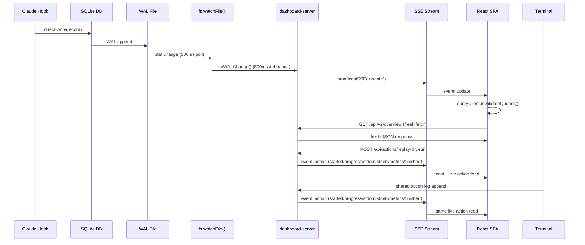

<!-- Verified: 2026-03-20 -->

# Live Dashboard — Server-Sent Events

## Status

Shipped. The dashboard uses SQLite WAL-based invalidation plus structured
action lifecycle events for live creator-loop feedback.

- `fs.watchFile()` monitors `~/.selftune/selftune.db-wal` with 500ms stat polling.
- A short-interval tail loop watches `~/.selftune/dashboard-action-events.jsonl`
  for cross-process creator-loop output.

## Problem

The dashboard relied on polling (15–30s intervals per endpoint) to show new data. Combined with a 15s server-side materialization TTL and React Query's `staleTime`, new invocations could take 30+ seconds to appear — or not appear at all until a hard refresh cleared all cache layers.

## Target Solution

Replace polling as the primary update mechanism with Server-Sent Events (SSE). The target design is for the dashboard server to watch the SQLite WAL file for changes and push update notifications to all connected browser tabs in real time.

## Target Architecture

## Server Side

### SSE Endpoint

`GET /api/v2/events` returns a `text/event-stream` response. Each connected client gets a `ReadableStreamDefaultController` tracked in a `Set`. On connection, a heartbeat comment (`: connected`) is sent so the client knows the stream is alive.

### SQLite WAL Watcher

`fs.watchFile()` monitors the SQLite WAL file (`~/.selftune/selftune.db-wal`) with 500ms stat polling. When hooks write directly to SQLite, the WAL file's modification time or size changes, triggering the watcher.

A 500ms debounce timer coalesces rapid writes (e.g., a hook appending multiple records in sequence) into a single broadcast cycle.

### No Separate Materialization Step

Because hooks write directly to SQLite, there is no separate materialization step in the hot path. The data is already in the database when the WAL watcher fires. The server simply broadcasts the SSE event and the next API query reads fresh data directly from SQLite.

### Shared Action Stream

Supported creator-loop commands (`eval generate`, `eval unit-test --generate`,
`evolve`, `evolve --dry-run`, `grade baseline`, `watch`, `evolve rollback`,
and `orchestrate`) append lifecycle events to
`~/.selftune/dashboard-action-events.jsonl`. The dashboard server tails
that append-only log on a short interval and rebroadcasts each record as
an `action` SSE event. This lets terminal-run commands appear in the same
live activity feed as dashboard-triggered actions. The same stream also
now carries `metrics` events when a nested runtime exposes structured
telemetry, such as Claude Code replay running with `--output-format
stream-json`. Replay validation also emits structured `progress` events
for each eval entry so the live-run screen can show `eval n/N`, query
snippets, and pass/fail evidence while the loop is still executing.

The server keeps a short in-memory history of recent action events and
replays that history to new `/api/v2/events` subscribers. This lets the
live-run screen reconstruct the current run even when the page opens
after the action has already started.

### Fan-Out

`broadcastSSE(eventType)` iterates all connected controllers and enqueues the SSE payload. Disconnected clients are silently removed from the set.

### Cleanup

On shutdown (`SIGINT`/`SIGTERM`), the WAL file watcher is removed via `fs.unwatchFile()`, SSE client controllers are closed, and debounce timers are cleared before the server stops.

## Client Side

### `useSSE` Hook

A React hook that opens an `EventSource` to `/api/v2/events` and listens for `update` and `action` events. `update` invalidates cached queries. `action` events populate a live action feed and drive toast notifications while dashboard-triggered or terminal-run creator-loop commands are running. Dedicated live-run screens can consume `progress` and `metrics` stages from the same event stream and render them inline in the streaming log.

The hook is mounted once in `DashboardShell` (the root layout component).

### Polling as Fallback

All React Query hooks retain `refetchInterval` but relaxed to 60s (was 15–30s). This serves as a safety net if:

- SSE connection drops and `EventSource` is reconnecting
- The server restarts and watchers haven't initialized yet
- The browser doesn't support SSE (unlikely but defensive)

`staleTime` was reduced to 5s (was 10–30s) so that SSE-triggered invalidations result in immediate network requests rather than returning cached data.

## Target Latency Budget

| Stage                            | Time        |
| -------------------------------- | ----------- |
| Hook writes SQLite               | ~5ms        |
| `fs.watchFile` poll interval     | 500ms       |
| Debounce window                  | 500ms       |
| SSE broadcast + network          | ~10ms       |
| React Query invalidation + fetch | ~100ms      |
| **Total**                        | **~1100ms** |

After the WAL cutover lands, new data should appear in the dashboard within ~1 second of a hook writing to SQLite.

## Files Changed

| File                                                       | Change                                                                                         |
| ---------------------------------------------------------- | ---------------------------------------------------------------------------------------------- |
| `cli/selftune/dashboard-server.ts`                         | SSE endpoint, SQLite WAL watcher, action broadcast, recent-action backfill, cleanup            |
| `cli/selftune/routes/actions.ts`                           | Stream stdout/stderr chunks into SSE action events and pass action context into child commands |
| `cli/selftune/dashboard-action-stream.ts`                  | Shared terminal-run action event writer                                                        |
| `cli/selftune/dashboard-action-events.ts`                  | Shared cross-process action context plus progress/metrics event writers                        |
| `cli/selftune/evolution/validate-host-replay.ts`           | Claude `stream-json` metrics extraction and per-eval progress emission for replay runs         |
| `cli/selftune/index.ts`                                    | Auto-enable shared action stream for supported commands                                        |
| `apps/local-dashboard/src/hooks/useSSE.ts`                 | EventSource + query invalidation + action toasts                                               |
| `apps/local-dashboard/src/lib/live-action-feed.ts`         | Client-side action event store, dedupe, inline progress/metrics log rendering                  |
| `apps/local-dashboard/src/components/live-action-feed.tsx` | Floating live creator-loop panel                                                               |
| `apps/local-dashboard/src/pages/LiveRun.tsx`               | Dedicated creator-loop streaming screen with live metrics and replay progress                  |
| `apps/local-dashboard/src/App.tsx`                         | Mount `useSSE`, feed, and toaster                                                              |
| `apps/local-dashboard/src/hooks/useOverview.ts`            | Polling 15s → 60s fallback, staleTime 10s → 5s                                                 |
| `apps/local-dashboard/src/hooks/useSkillReport.ts`         | Polling 30s → 60s fallback, staleTime 30s → 5s                                                 |
| `apps/local-dashboard/src/hooks/useDoctor.ts`              | Polling 30s → 60s fallback, staleTime 20s → 5s                                                 |
| `apps/local-dashboard/src/hooks/useOrchestrateRuns.ts`     | Polling 30s → 60s fallback, staleTime 15s → 5s                                                 |

## Design Decisions

**Why SSE over WebSocket?** SSE is simpler (plain HTTP, auto-reconnect built into `EventSource`), unidirectional (server→client is all we need), and requires zero additional dependencies. Bun's `Bun.serve` supports streaming responses natively.

**Why `fs.watchFile` instead of `fs.watch`?** WAL files are modified in place and `fs.watch` (based on `kqueue`/`inotify`) can miss in-place modifications on some platforms. `fs.watchFile` uses stat polling which reliably detects size and mtime changes at the cost of a fixed polling interval. The 500ms poll interval keeps latency acceptable.

**Why 500ms debounce?** Hooks often write multiple records in quick succession (e.g., session-stop writes telemetry + skill usage). Without debounce, each poll hit would trigger a separate broadcast cycle. 500ms is long enough to coalesce bursts but short enough to feel responsive.

**Why invalidate all queries?** A SQLite write could affect any endpoint (overview, skill report, doctor). Targeted invalidation would require parsing the change to determine which queries are affected. Blanket invalidation is simpler and the cost of a few extra fetches is negligible for a local dashboard.

**Why keep polling?** SSE connections can drop. `EventSource` reconnects automatically, but during the reconnect window (up to 3s by default) no updates arrive. The 60s polling fallback ensures the dashboard never goes completely stale.

**Why a shared JSONL action log for terminal runs?** Dashboard-triggered
commands can stream directly from the server process, but commands launched
from another terminal need a cross-process handoff. A tiny append-only log
in `~/.selftune` is enough to bridge that gap without introducing sockets,
locks, or a dedicated broker.

**Why normalize Claude `stream-json` into dashboard metrics events?** The
raw Claude event stream is verbose and provider-specific. The dashboard only
needs stable fields like platform, model, session id, tokens, duration, and
cost. Emitting those as a provider-agnostic `metrics` stage keeps the UI
portable while still taking advantage of Claude's richer runtime telemetry.

**Why add a separate `progress` stage instead of parsing stdout?** Replay
validation already knows when each eval starts and finishes. Emitting typed
`progress` records at that layer avoids fragile log parsing and makes it
possible to show `eval n/N`, query snippets, and pass/fail evidence even
when the terminal itself stays quiet until the final summary.

## Limitations

- `fs.watchFile()` uses stat polling (500ms interval), so there is an inherent latency floor compared to event-driven watchers.
- On network filesystems, stat polling may be slower or return stale metadata.
- The debounce means writes within the same 500ms window are coalesced; the dashboard won't show intermediate states within a burst.
